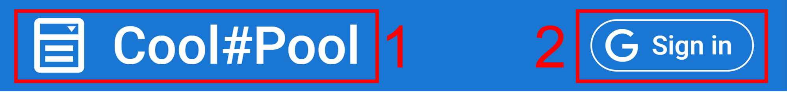
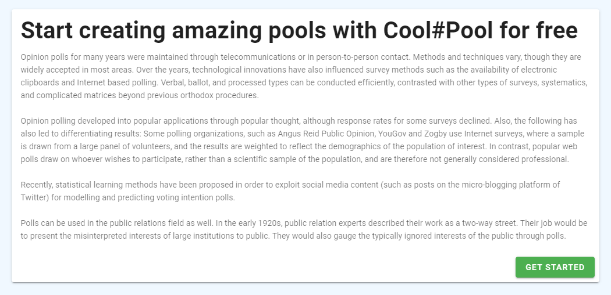
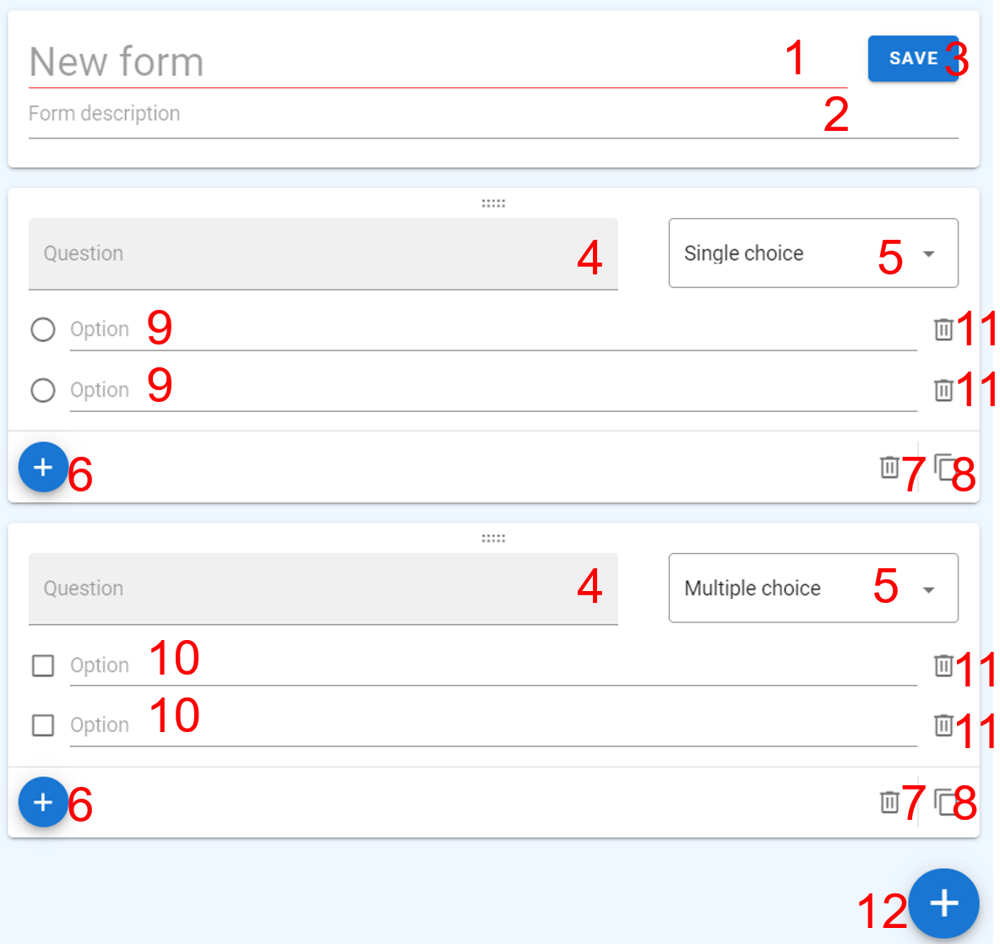

# Cool#Pool

[**Cool#Pool**](https://valerachuk.github.io/cool-pool/) is social polls UI and layout. Created on Vue.js and Typescript using Vuetify as design framework. Docs were created on VuePress.

## Table of contents

- [About](#cool-pool)
- [Demo](#demo)
- [Technologies](#technologies)
- [View diagram](#view-diagram)
- [Page Reference](#page-reference)
- [Notes](#notes)

## Demo

- Check it now on https://valerachuk.github.io/cool-pool/
- Docs: https://valerachuk.github.io/cool-pool/docs/

## Technologies

- [Vue.js](https://vuejs.org/) 2
- [Vuetify](https://vuetifyjs.com/en/)
- [Typescript](https://www.typescriptlang.org/)
- [vue-apexcharts](https://www.npmjs.com/package/vue-apexcharts)
- [VuePress](https://vuepress.vuejs.org/)

## View diagram

https://www.figma.com/file/rJkQNmhDPp93aLiVHPsELk/cool-pool-view-diagram

## Page Reference

### [Header](https://valerachuk.github.io/cool-pool/)

1. Title, if you logged in, it redirects you to the [pool list page](#pool-list). I if not - to [home page](#home)
2. `Sign in` / `Sign out` button, allows you to [**sign in**](https://valerachuk.github.io/cool-pool/docs/manual.html#signing-in) / [**sign out**](https://valerachuk.github.io/cool-pool/docs/manual.html#signing-out)

### [Home](https://valerachuk.github.io/cool-pool/)

Shows basic info about the project.

### [Pool list](https://valerachuk.github.io/cool-pool/#/list)

Here you can view all your pools.

1. Search field, allows you to find a required pool.
2. `NEW POOL` button, [creates a new pool](https://valerachuk.github.io/cool-pool/docs/manual.html#creating-a-pool).
3. :eye: button, allows to [view statistics](https://valerachuk.github.io/cool-pool/docs/manual.html#viewing-pool-results).
4. :link: button, copies public link of a pool to clipboard.
5. :wastebasket: button, [deletes a pool](https://valerachuk.github.io/cool-pool/docs/manual.html#deleting-a-pool).

### [Pool creation](https://valerachuk.github.io/cool-pool/#/new)

Here you can create a pool.

1. From name field, required. :exclamation:
2. Form description field.
3. `SAVE` button, submits your pool.
4. Question block name field, required. :exclamation:
5. `Single choice` / `Multiple choice` select, allows you to choose between `exactly one` / `at least one` answer for a question block.
6. Small :heavy_plus_sign: button, adds an answer option to a question block.
7. :wastebasket: button, deletes a question block.
8. :clipboard: button, duplicates a question block.
9. Question block answer option field :white_circle:, \_requires **exactly one** answer from an interviewee\*, required. :exclamation:
10. Question block answer option field :white_large_square:, \_requires **at least** answer from an interviewee\*, required. :exclamation:
11. :wastebasket: button, deletes an answer option from a question block.
12. Big :heavy_plus_sign: button, adds a question block to pool.

**Question block** - question that allows an interviewee to choose answer option(s).
There are two types of question blocks, that require `exactly one` and `at least one` answer.

**Required field** - field, that required for submitting a form.

### [Pool statistics](https://valerachuk.github.io/cool-pool/#/answers/2penfcvc4d1)

Shows detailed pool statistics.

### [Answer](https://valerachuk.github.io/cool-pool/#/fill/2penfcvc4d1)

Collects an answer from interviewees

1. Question block, that requires **`at least one`** answer.
2. Question block, that requires **`exactly one`** answer.
3. `SEND` button, submits an answer.

**Question block** - question that allows an interviewee to choose answer option(s).
There are two types of question blocks, that require `exactly one` and `at least one` answer.

**Required answer** - answer, that required for submitting a form.

## Notes

- This is not web app, this is just UI layout
- Yes, "pool" is a typo...
