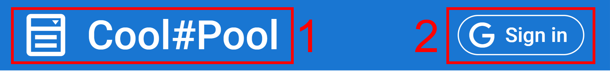
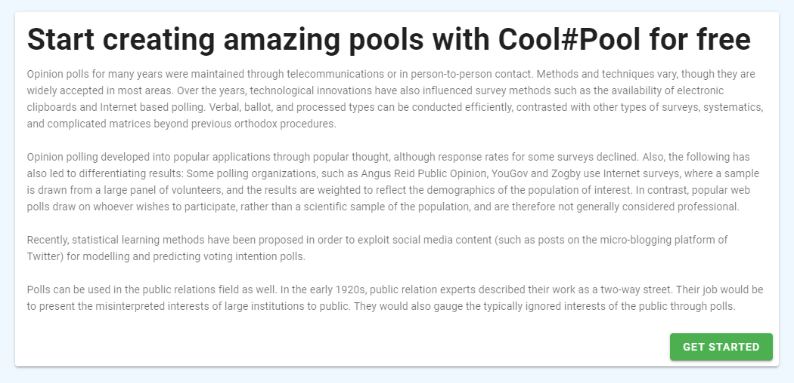
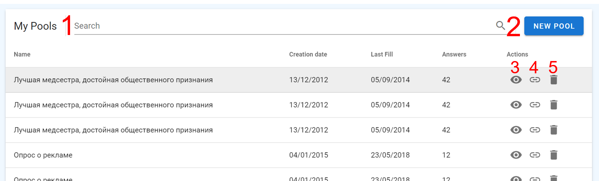
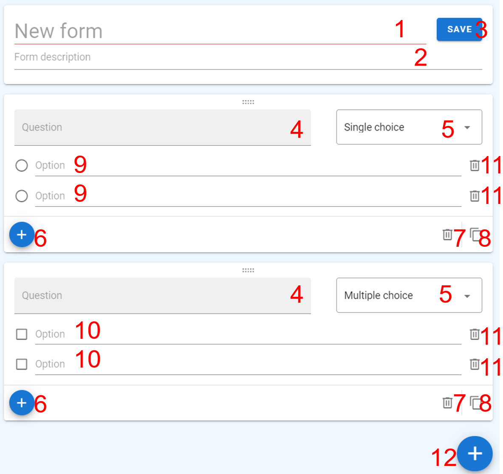
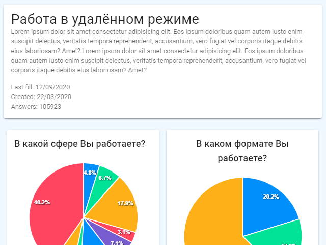
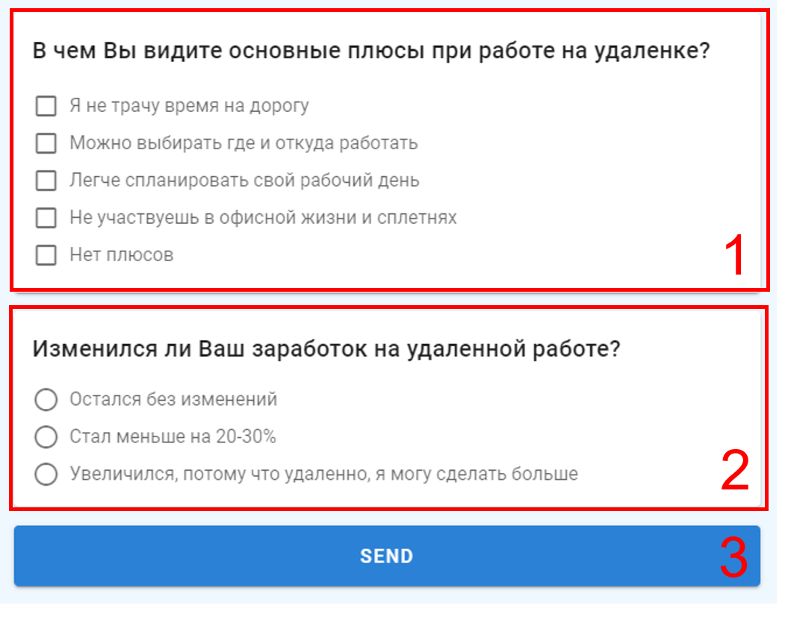

# Page Reference

[[toc]]

## Header

1. Title, if you logged in, it redirects you to the [pool list page](./pageReference.md#pool-list). I if not - to [home page](./pageReference.md#home)
2. `Sign in` / `Sign out` button, allows you to [**sign in**](./manual.md#signing-in) / [**sign out**](./manual.md#signing-out)

## Home

Shows basic info about the project.

## Pool list

Here you can view all your pools.

1. Search field, allows you to find a required pool.
2. `NEW POOL` button, [creates a new pool](./manual.md#creating-a-pool).
3. :eye: button, allows to [view statistics](./manual.md#viewing-pool-results).
4. :link: button, copies public link of a pool to clipboard.
5. :wastebasket: button, [deletes a pool](./manual.md#deleting-a-pool).

## Pool creation

Here you can create a pool.

1. From name field, required. :exclamation:
2. Form description field.
3. `SAVE` button, submits your pool.
4. Question block name field, required. :exclamation:
5. `Single choice` / `Multiple choice` select, allows you to choose between `exactly one` / `at least one` answer for a question block.
6. Small :heavy_plus_sign: button, adds an answer option to a question block.
7. :wastebasket: button, deletes a question block.
8. :clipboard: button, duplicates a question block.
9. Question block answer option field :white_circle:, _requires **exactly one** answer from an interviewee_, required. :exclamation: 
10. Question block answer option field :white_large_square:, _requires **at least** answer from an interviewee_, required. :exclamation: 
11. :wastebasket: button, deletes an answer option from a question block.
12. Big :heavy_plus_sign: button, adds a question block to pool.

::: tip
**Question block** - question that allows an interviewee to choose answer option(s).
There are two types of question blocks, that require `exactly one` and `at least one` answer.
:::

::: tip
**Required field** - field, that required for submitting a form.
:::

## Pool statistics

Shows detailed pool statistics.  
[View in manual](./manual.md#viewing-pool-results).

## Answer

Collects an answer from interviewees  
[View in manual](./manual.md#answering-a-pool).

1. Question block, that requires **`at least one`** answer.
2. Question block, that requires **`exactly one`** answer.
3. `SEND` button, submits an answer.

::: tip
**Question block** - question that allows an interviewee to choose answer option(s).
There are two types of question blocks, that require `exactly one` and `at least one` answer.
:::

::: tip
**Required answer** - answer, that required for submitting a form.
:::
